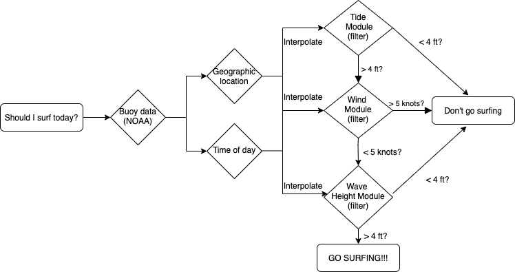

```{r setup, include=FALSE}
knitr::opts_chunk$set(echo = TRUE)
```

## Assignment 1b

Gabriel De La Rosa, Claudia Flores, Alex Ehrens


### Diagram




### Model contract:

Our model is a decision making tool that takes real-time marine environmental data and geographic location and returns a recommendation about whether someone should decide to go surfing that day.

**Inputs**: 

- Geographic location (GPS point)
- Time of day
- Wind data (NOAA)
- Tide data (NOAA)
- Buoy data (NOAA)

**Outputs**:

- Pop up screen as to whether or not one should go surfing.

**Parameters**:

- Max acceptable wind speed: 5 kts
- Acceptable wind direction: direction from land to sea (NE in SB)
- Max acceptable tide: 4 ft
- Min acceptable significant wave height: 4 feet

**Modules**:

- Tide module: Binary decision module that determines if the tide is good for surfing
- Wind module: Binary decision module that determines if the wind is good for surfing
- Wave module: Binary decision module that determines if the swell is good for surfing

### Module contracts

#### Tide module
Description: Takes geographic location and time of day and finds the nearest coastal point, then determines how high the tide is at that point.

**Inputs**

- Geographic location
- Time of day
- NOAA tide data

**Parameters**

- Max acceptable tide: 4ft

**Output**

- If tide is < 4ft, output is go surfing
- If tide is > 4 ft, output is do not go surfing

#### Wind Module
Description: Takes geographic location and time of day and finds the nearest coastal wind measurement from NOAA data, then determines if windspeed and direction are good for surfing. Wind direction is deemed acceptable if it is within 90º of perpendicular to the coastline at the nearest geographic point, and flowing out to sea, only if windspeed is above 5kts.

**Inputs**

- Geographic location
- Time of day
- NOAA wind data

**Parameters**

- Max acceptable wind speed: 5 kts
- Acceptable wind direction: within 90º of perpendicular to the coastline at the nearest geographic point.

**Outputs**:

- If wind is <5kts or from a good direction, output is go surfing
- If wind is >5kts or from a bad direction, output is do not go surfing

#### Wave Module
Description: Takes geographic location and time of day and finds the nearest NOAA significant waveheight data, then determines if the swell height and period are favorable enough to go surfing. Swells larger than 4 feet and with a period longer than 10 seconds are deemed favorable.

**Inputs**

- Geographic location
- Time of day
- NOAA significant wave height data

**Parameters**

- Max acceptable wave height: 4 feet
- Min acceptable swell period: 10 seconds

**Outputs**:

- If swell is >4 ft and swell period is > 10s, output is go surfing
- If swell is <4 ft and swell period is < 10s, output is do not go surfing


